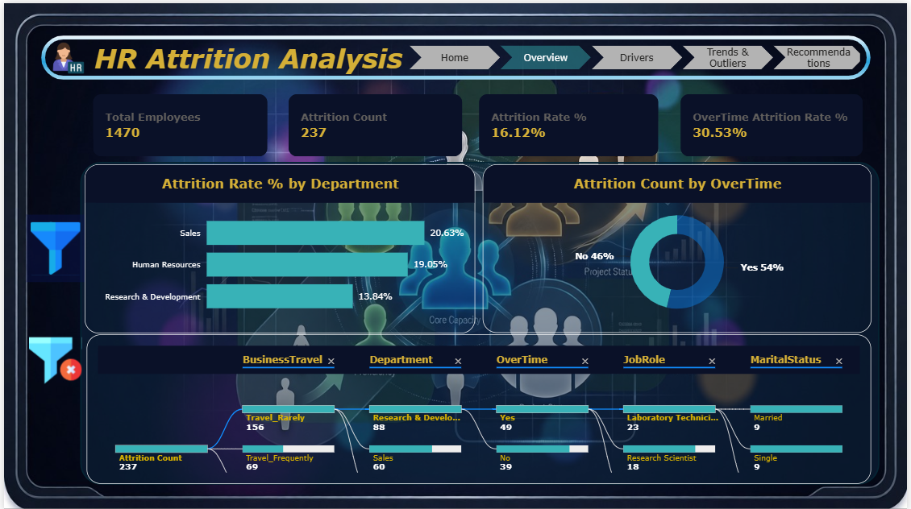
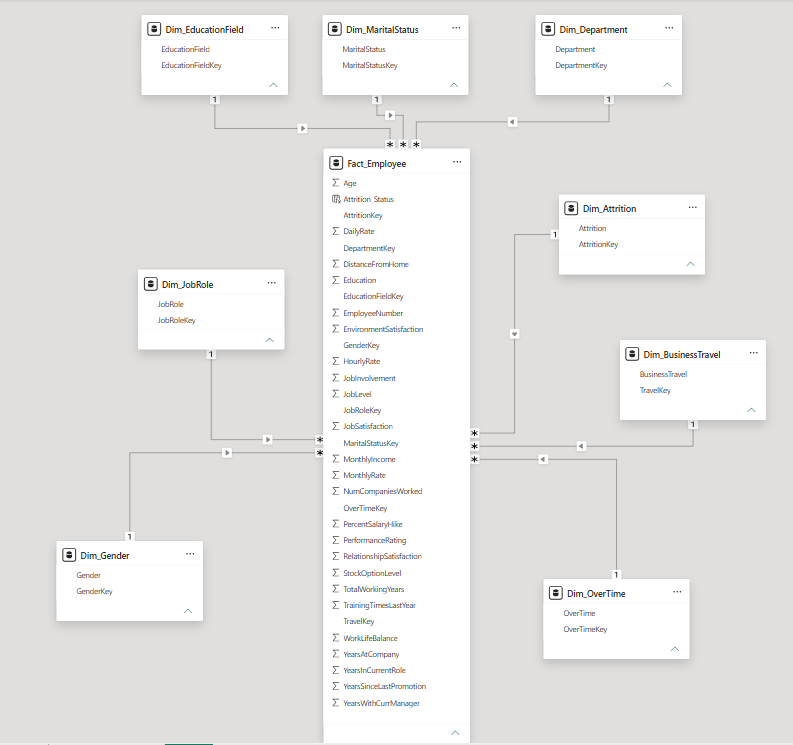

<div align="center">


<br/>


</div>

<br/>

## 📌 About the Project

A complete BI Analyst case study built on the IBM HR Attrition dataset (1,470 employees / 35 attributes) for **GBS BI HUB**. The project covers the full analytics lifecycle: star-schema modeling → DAX measures → outlier & trend analysis → an interactive Power BI dashboard → SQL analysis → stakeholder recommendations.

<div align="center">

| 👥 Employees | 🚪 Attrition Count | 📉 Attrition Rate | ⏰ OverTime Attrition |
|:---:|:---:|:---:|:---:|
| **1,470** | **237** | **16.1%** | **30.5%** |

</div>

---

## 🎬 Dashboard Preview

<div align="center">

</div>

---

## 🗂️ Repository Structure

```text
HR_Attrition_Analysis/
├── README.md
├── Assets/
│   ├── Icons/
│   │   ├── HR Attrition image....png
│   │   ├── clear-filter.png
│   │   ├── desk.png
│   │   ├── filter.png
│   │   └── hr-manager.png
│   └── Screenshots/
│       ├── Data_Modeling.png
│       ├── Drivers_Page.png
│       ├── Home_Page.png
│       ├── Measures.png
│       ├── Overview_Page.png
│       ├── Recommendations_Page.png
│       └── Trands_outliers_Page.png
├── Dashboard/
│   └── HR Attrition Dashboard.pbix
├── Data/
│   └── GBS BI HUB - BI Analyst - HR Attrition Case Study.xlsx
├── Recommended/
│   ├── Page 1.jpeg
│   ├── Page 2.jpeg
│   └── Task_Info.png
└── Report/
    ├── HR_Attrition_Report.docx
    └── attrition_by_department.sql
```

---

## 🧱 Data Model — Star Schema

<div align="center">

&nbsp;→&nbsp;

</div>

One `Fact_Employee` table (grain: **one row = one employee**) connected to 8 dimension tables:

`Dim_Attrition` · `Dim_BusinessTravel` · `Dim_Department` · `Dim_EducationField` · `Dim_Gender` · `Dim_JobRole` · `Dim_MaritalStatus` · `Dim_OverTime`

> All categorical/text columns live only inside their dimension table — the fact table stores numeric measures and surrogate keys only, keeping the model fast and clean.

<div align="center">

</div>

<details>
<summary><b>📐 Click to see relationship rules</b></summary>
<br/>

- All relationships are **1 (dimension) → \* (fact)**, single-direction filtering
- No repeated text columns inside `Fact_Employee`
- Surrogate keys only: `AttritionKey`, `TravelKey`, `DepartmentKey`, `EducationFieldKey`, `GenderKey`, `JobRoleKey`, `MaritalStatusKey`, `OverTimeKey`

</details>

---

## 🧮 DAX Measures

15 measures written with `VAR` / `RETURN`, grouped into 4 display folders inside the model:

<div align="center">

| 📁 Folder | Measures |
|---|---|
| **Core Metrics** | Total Employees · Attrition Count · Attrition Rate % |
| **Income & Tenure** | Avg Monthly Income (Leavers/Stayers) · Tenure Gap |
| **OverTime Analysis** | OverTime / No-OverTime Attrition Rate % |
| **Risk Segments** | Highest-Risk JobRole · JobLevel 1 · Zero Stock Option · High Risk Segment · JobRole Rank |

</div>

Full DAX code lives in [`Report/HR_Attrition_Report.docx`](Report/HR_Attrition_Report.docx).

```dax
Attrition Rate % =
DIVIDE([Attrition Count], [Total Employees], 0)
```

---

## 📈 Key Findings

<div align="center">

| Driver | Highest-Risk Segment | Rate |
|:---|:---:|:---:|
| 🕐 OverTime | Yes |  |
| 💼 Job Role | Sales Representative |  |
| 💍 Marital Status | Single |  |
| 📈 Stock Option Level | 0 |  |
| ⚖️ Work-Life Balance | Poor (1) |  |

</div>

Employees who leave earn **~30% less**, have **~35% shorter** tenure with their current manager, and are on average **4 years younger** than employees who stay.

---

## 🖥️ Dashboard Pages

<div align="center">

| Page | Content | Screenshot |
|---|---|:---:|
| 🏠 **Home** | Navigation cover page | [View](Assets/Screenshots/Home_Page.png) |
| 📊 **Overview** | KPI cards · attrition by department/overtime · decomposition tree | [View](Assets/Screenshots/Overview_Page.png) |
| 🎯 **Drivers** | Attrition by job role, marital status, stock options, income | [View](Assets/Screenshots/Drivers_Page.png) |
| 🔍 **Trends & Outliers** | Decomposition tree · satisfaction pivot · income vs. experience scatter | [View](Assets/Screenshots/Trands_outliers_Page.png) |
| ✅ **Recommendations** | Narrative insights and actionable next steps | [View](Assets/Screenshots/Recommendations_Page.png) |

</div>

---

## ✅ Recommendations Summary

- [x] **Address overtime & workload** — enforce workload balance policies, especially in Sales and R&D
- [x] **Revise entry-level compensation** — restructure salary scales, earlier stock vesting
- [x] **Targeted retention for Sales Representatives** — stay-interviews, commission review
- [x] **Strengthen early-tenure onboarding** — most attrition happens in the first 2 years
- [x] **Improve work-life balance** — review travel frequency and workload for at-risk roles

Full write-up in [`Report/HR_Attrition_Report.docx`](Report/HR_Attrition_Report.docx). Original task brief and raw dataset excerpts are in [`Recommended/`](Recommended/).

---

## 🗃️ SQL Query

```sql
SELECT Department, COUNT(*) AS AttritionCount
FROM EmployeeAttrition
WHERE Attrition = 'Yes'
GROUP BY Department
ORDER BY AttritionCount DESC;
```

<div align="center">

| Department | AttritionCount |
|:---|:---:|
| Research & Development | 133 |
| Sales | 92 |
| Human Resources | 12 |

</div>

Query file: [`Report/attrition_by_department.sql`](Report/attrition_by_department.sql)

---

## 🛠️ Tools Used

<div align="center">


</div>

---

<div align="center">


**⭐ If this project helped you, consider giving it a star!**

</div>
